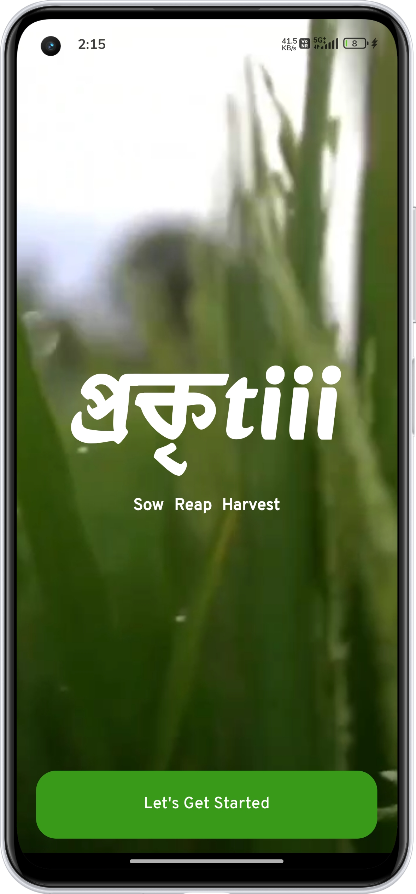
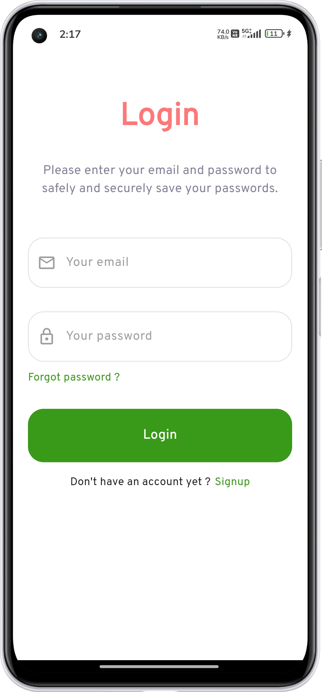
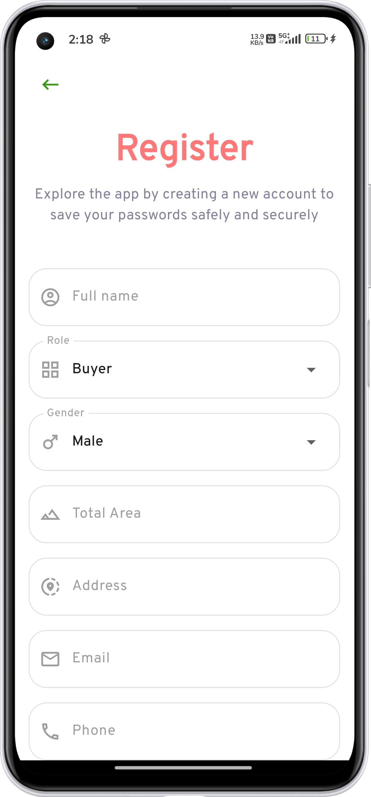
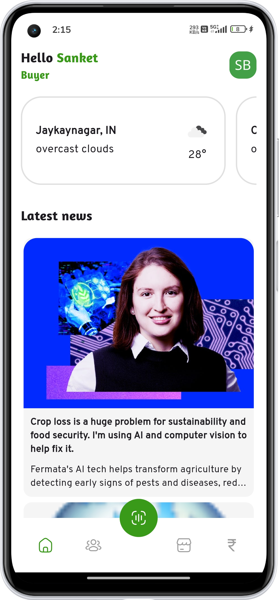
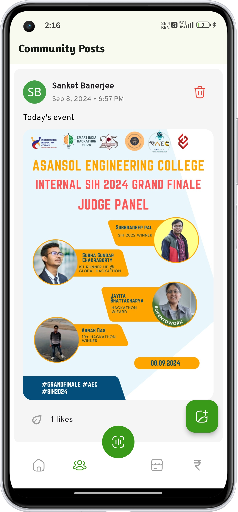
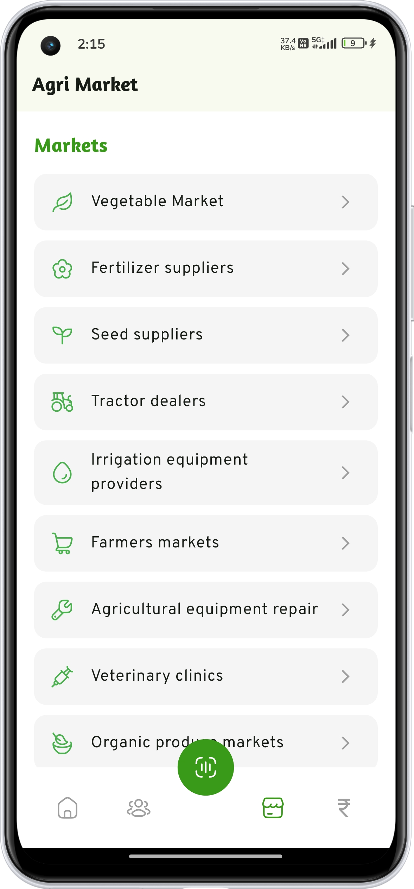
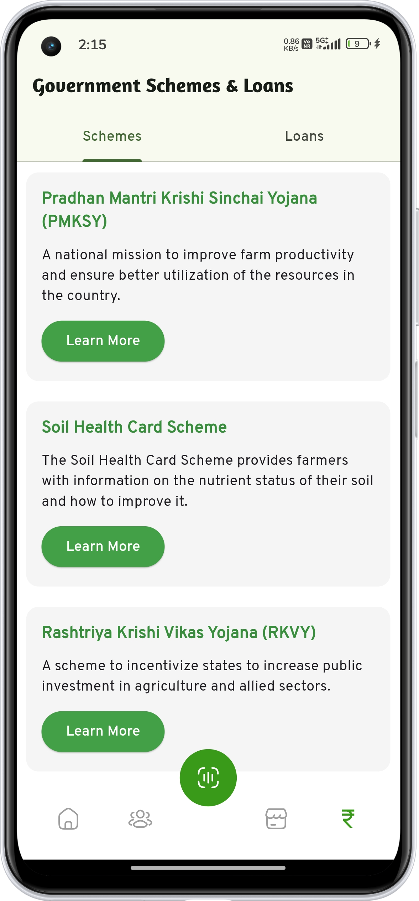
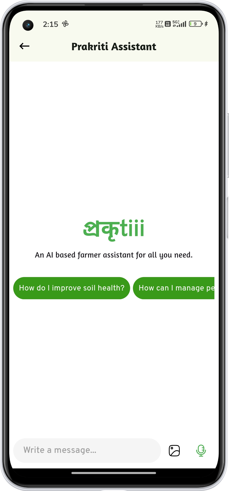
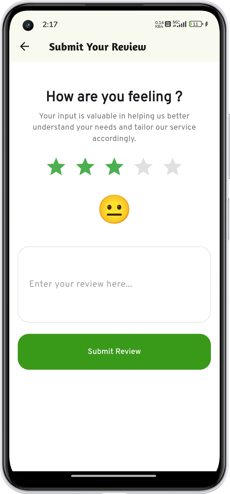

# Prakriti

Prakriti is a comprehensive Flutter application designed to provide various functionalities related to agriculture, including community interaction, loan information, and market schemes. The app integrates Firebase for authentication and uses the Gemini API for additional features.

## Features

- **Splash Screen**: A visually appealing splash screen with a video background.
- **User Authentication**: Firebase authentication with email verification.
- **Community Pages**: A space for users to post content and interact with the community.
- **Loan and Scheme Information**: Detailed information on agricultural loans and market schemes.
- **Real-Time Messaging**: Communication features powered by the Gemini API.
- **Dynamic UI**: Customizable user interface with Google Fonts and material design.

## Installation

1. **Clone the Repository**

   ```bash
   git clone https://github.com/Sanket2004/prakriti.git
   ```

2. **Navigate to the Project Directory**

   ```bash
   cd prakriti
   ```

2. **Install Dependencies**

    ```bash
    flutter pub get
    ```

3. **Configure Firebase**

- Follow the Firebase setup guide to configure Firebase for your Android app.
- Place the ``` google-services.json``` file in the android/app directory.

4. **Set Up API Keys**

Replace the placeholder ``` GEMINI_API_KEY``` in ```main.dart``` with your actual Gemini API key.

5. **Run the App**

    ```bash
    flutter run
    ```

## File Structure

    prakriti/
    │
    ├── lib/
    │   ├── constants/
    │   │   └── const.dart
    │   ├── navigation/
    │   │   └── bottomNavigation.dart
    │   ├── screens/
    │   │   └── splash_Screen.dart
    │   │   └── community_page.dart
    │   │   └── forgot_pass_screen.dart
    │   │   └── home.dart
    │   │   └── loan_page.dart.dart
    │   │   └── market_screen.dart
    │   │   └── news_page.dart
    │   │   └── posts_list_screen.dart
    │   │   └── profile_page.dart
    │   │   └── review_page.dart
    │   │   └── schemes_screen.dart
    │   │   └── signup.dart
    │   │   └── voice_chat.dart
    │   │   └── weather_screen.dart
    │   ├── main.dart
    │   └── components/
    │   │   └── button.dart
    │   └── services/
    │   │   └── news_service.dart
    ├── android/
    │   ├── app/
    │   │   └── google-services.json
    │   └── ...
    ├── ios/
    │   └── ...
    ├── pubspec.yaml
    └── README.md


## ScreenShots

<div style="display: flex; flex-wrap: wrap; gap: 16px; ">
  <div style="flex: 1 1 200px; max-width: 200px; box-sizing: border-box;">
    <h3>Splash Screen Page</h3>
    
  </div>
  <div style="flex: 1 1 200px; max-width: 200px; box-sizing: border-box;">
    <h3>Login Screen</h3>
    
  </div>
  <div style="flex: 1 1 200px; max-width: 200px; box-sizing: border-box;">
    <h3>Register Screen</h3>
    
  </div>
  <div style="flex: 1 1 200px; max-width: 200px; box-sizing: border-box;">
    <h3>Forgot Password Screen</h3>
    
  </div>
  <div style="flex: 1 1 200px; max-width: 200px; box-sizing: border-box;">
    <h3>Home Screen</h3>
    
  </div>
  <div style="flex: 1 1 200px; max-width: 200px; box-sizing: border-box;">
    <h3>Community Screen</h3>
    
  </div>
  <div style="flex: 1 1 200px; max-width: 200px; box-sizing: border-box;">
    <h3>Market Screen</h3>
    
  </div>
  <div style="flex: 1 1 200px; max-width: 200px; box-sizing: border-box;">
    <h3>Loans & Schemes Screen</h3>
    
  </div>
  <div style="flex: 1 1 200px; max-width: 200px; box-sizing: border-box;">
    <h3>AI Assitant Screen</h3>
    
  </div>
  <div style="flex: 1 1 200px; max-width: 200px; box-sizing: border-box;">
    <h3>Rating Screen</h3>
    
  </div>
</div>

## Dependencies

-  ```video_player: ^2.9.1```
-  ```google_fonts: ^6.2.1```
-  ```firebase_core: ^2.24.2```
-  ```firebase_auth: ^4.16.0```
-  ```flutter_animate: ^4.5.0```
-  ```cloud_firestore: ^4.14.0```
-  ```geolocator: ^13.0.1```
-  ```http: ^1.2.2```
-  ```weather: ^3.1.1```
-  ```speech_to_text: ^7.0.0```
-  ```firebase_storage: ^11.6.0```
-  ```image_picker: ^1.1.2```
-  ```permission_handler: ^11.3.1```
-  ```flutter_staggered_grid_view: ^0.6.1```
-  ```url_launcher: ^6.3.0```
-  ```file_picker: ^8.1.2```
-  ```hugeicons: ^0.0.7```
-  ```persistent_bottom_nav_bar: ^6.2.1```
-  ```flutter_gemini: ^2.0.5```
-  ```dash_chat_2: ^0.0.21```
-  ```photo_view: ^0.15.0```
-  ```flutter_rating_bar: ^4.0.1```
-  ```page_transition: ^2.1.0```

## Purpose
This project is build for Smart India Hackathon 2K24.